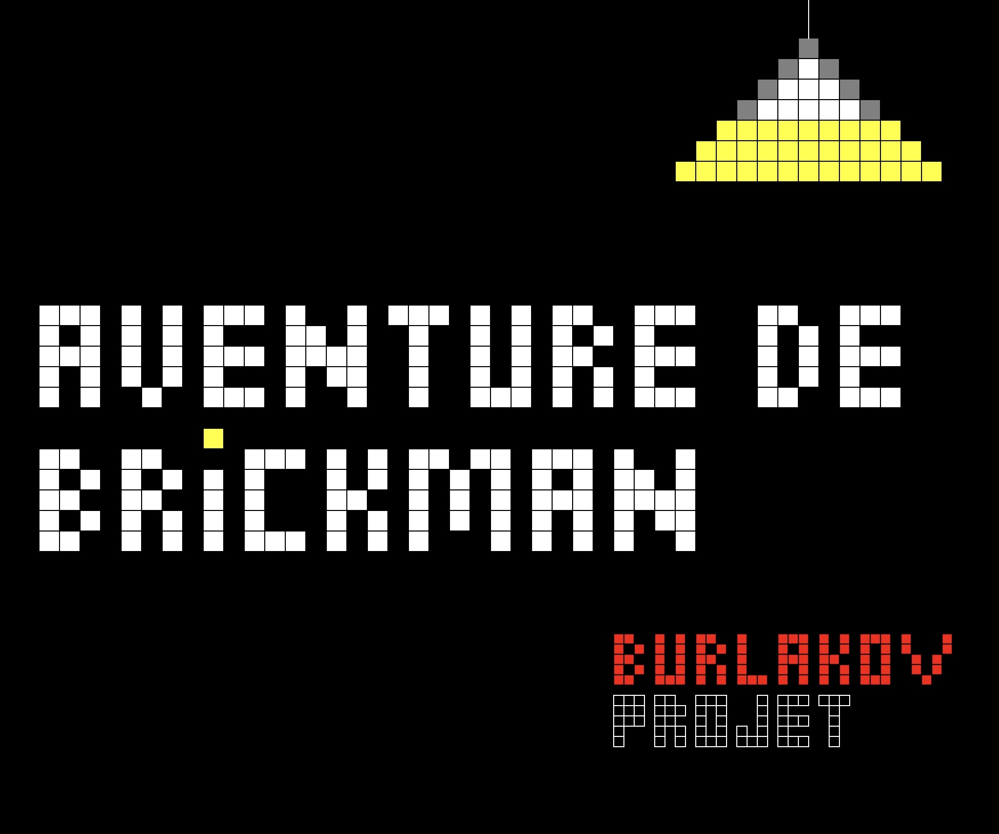
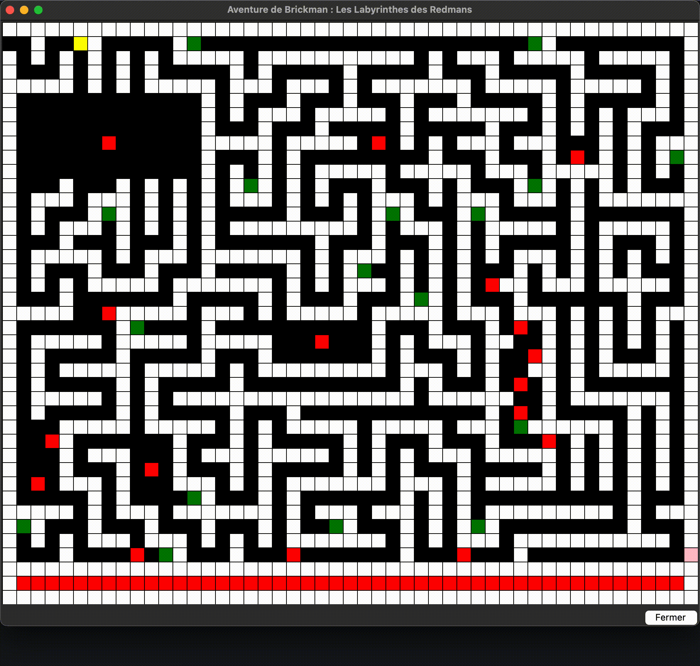
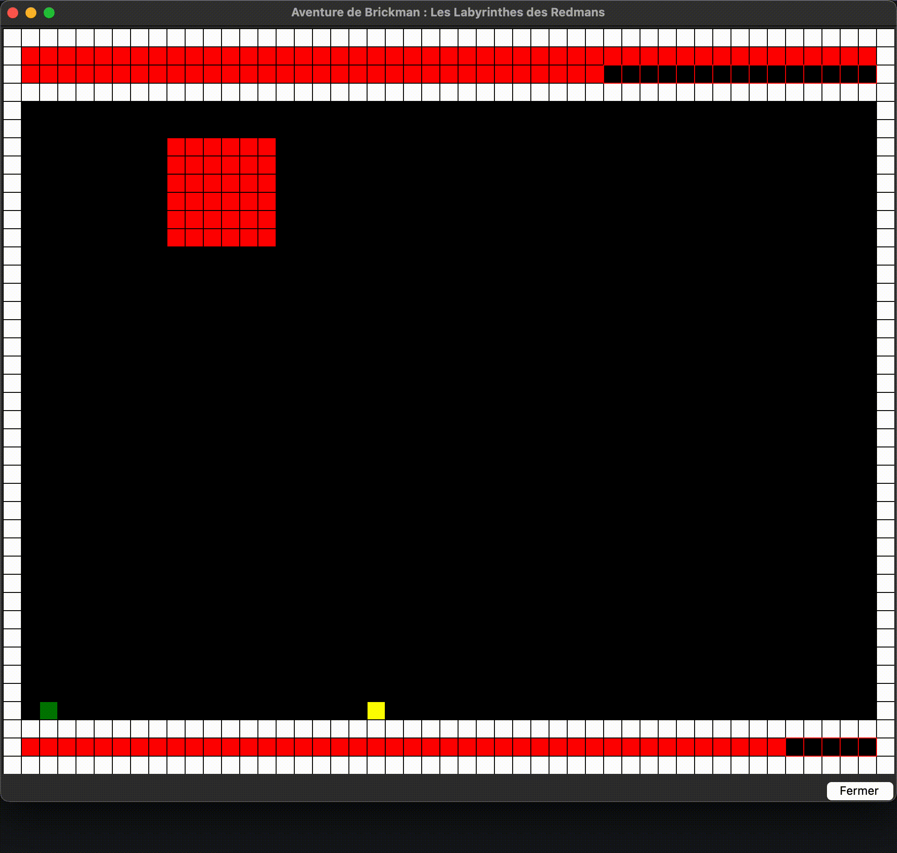

# Aventure de Brickman : Les Labyrinthes des Redmans

<p align="center">
  
</p>

    

**Student Project - 1st Year Computer Science Bachelor (L1)**
**Université Côte d'Azur**

## Overview
This project is a 2D arcade game developed in **Python** as part of my first semester of studies.

The player controls **Brickman**, a hero who must escape a series of mazes, survive against the **Redmans**, and defeat their leader, the **Redman Chief** (The Boss).

## Gameplay Demo

| Exploration & Redmans | Boss Fight Strategy |
| :---: | :---: |
|  |  |
| *Navigating the maze and avoiding enemies* | *Using bombs to defeat the Redman Chief* |

## Tools and Libraries
The game was developed under the following academic constraints:
* **Language:** Python 3
* **GUI:** `Tkinter` (standard library)
* **Image Processing:** `pnm.py` module (provided by Mr. Olivier Baldellon) for handling images and matrices.

## Features

* **Maze Exploration:** Navigation through multiple dynamically loaded levels.
* **Combat System:**
    * Health (HP) management.
    * Bomb planting mechanic to defeat the Boss.
* **"Limbo" Mechanic:** When the player loses all health, they are sent to Limbo and must find the exit to resurrect.
* **Final Boss:** A strategic fight against a boss with specific movement patterns and a dedicated health bar.
* **Matrix Handling:** Uses the `pnm` library (provided by Olivier Baldellon) to manipulate matrices and load image files (.ppm, .pbm).

## Prerequisites

To run this project, you need:

* **Python 3.x** installed on your machine.
* The **Tkinter** standard library (usually included with Python).

## Installation and Launch

1.  Clone this repository (or download the files):
    ```bash
    git clone https://github.com/burlakovdp/aventure_de_brickman.git
    cd aventure_de_brickman
    ```

2.  Ensure all resource files (folders `interface`, `cartes`, `donnees`, `limbo`) and the `pnm.py` module are present in the root directory.

3.  Run the game:
    ```bash
    python main.py
    ```

## Controls

| Key | Action |
| :--- | :--- |
| **Up Arrow (↑)** | Move Up |
| **Down Arrow (↓)** | Move Down |
| **Left Arrow (←)** | Move Left |
| **Right Arrow (→)** | Move Right |
| **Spacebar** | Plant a Bomb (Boss Level only) |

## Project Structure

* `main.py`: The entry point of the game and the main loop.
* `pnm.py`: Utility module for matrix and image file management (provided by Mr. Olivier Baldellon).
* `/cartes`: Contains `.pbm` files representing the level architecture.
* `/donnees`: `.txt` files containing object and enemy positions.
* `/interface`: Sprites and graphical elements (logo, menu, textures).

## Known Issues

Despite the tests performed, some technical limitations related to the Tkinter library remain:

* **Performance Dependency:** The movement speed and damage rate of the "Redmans" (enemies) may vary depending on the host machine's CPU performance.
* **Linux Display:** A slight rendering offset (approx. 3px on the top and left borders) may appear on Linux distributions due to window manager specificities.

## Author

Project created by **Danyil-Polina Burlakov** as part of the **1st Year Computer Science Bachelor (L1)** at **Université Côte d'Azur**.
